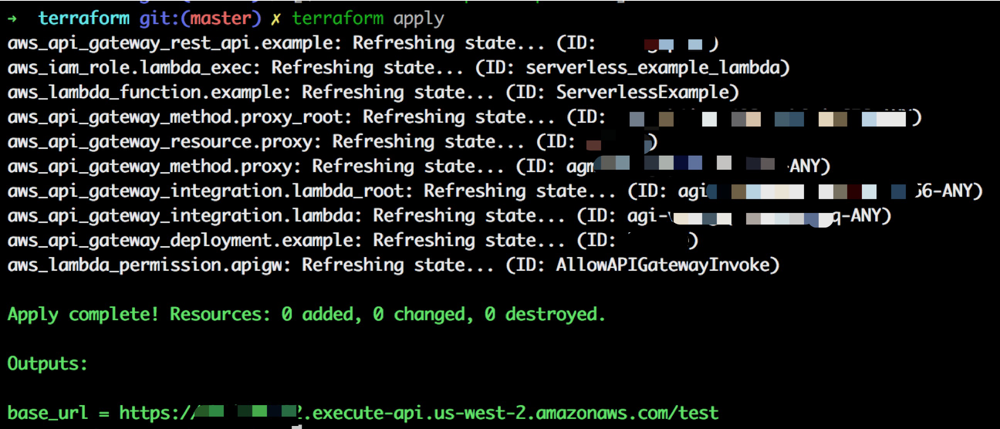

# Terraform-APIGateway-Lambda
A demo to set up APIGateway &amp; Lambda by Terraform

## Usage

### Use this repo as template codebase

- Fork this repo as a template or Clone Code:

```
git clone git@github.com:code-templates/terraform-APIGateway-lambda.git
```

- Package the NodeJS code to zip:

```
cd terraform-APIGateway-lambda
cd lambda-code
zip example.zip main.js
```

- Set up Lambda & API-gateway

```
cd ../terraform
export AWS_ACCESS_KEY_ID=xxxxx
export AWS_SECRET_ACCESS_KEY=xxxxx
terraform apply
```



